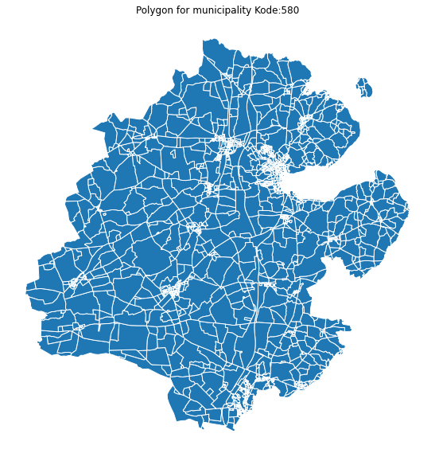
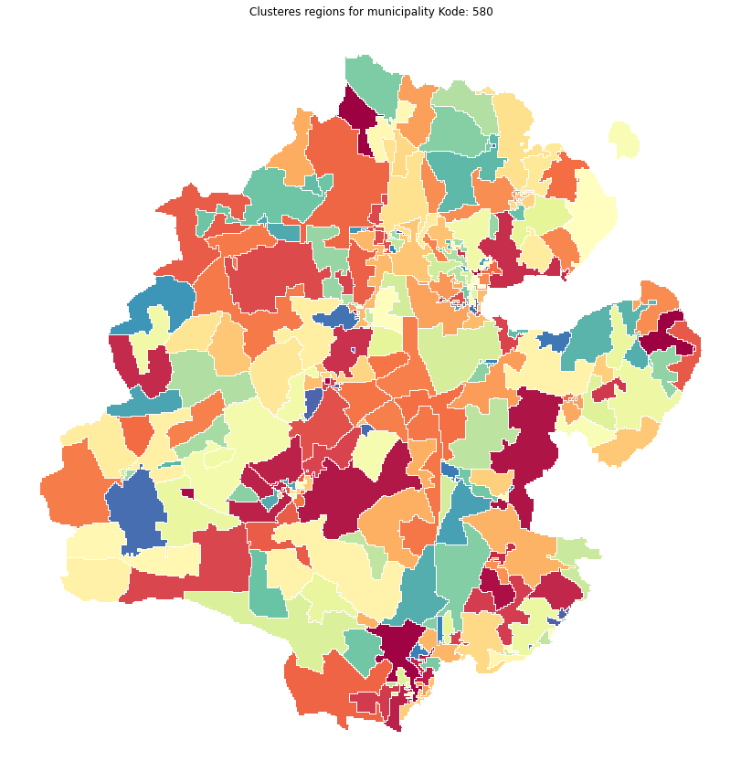

<p float="left">
  <a href="https://data.org"></a>
  <a href="https://www.en.build.aau.dk"></a>
  <a href="https://dataclinic.twosigma.com"></a>
</p>

# Open Source Geospatial Units in Denmark to Enable Action-Oriented Research and Decision-making

Aalborg University’s [Department of the Built Environment (BUILD)](https://www.en.build.aau.dk) seeks to empower data-informed action for more equitable economic opportunity across Denmark. Over the years, their team has developed innovative insights and new metrics related to quality of life at the fine-grained 100x100m grid level using sensitive administrative data from Statistics Denmark. With financial support from data.org’s Inclusive Growth and Recovery Challenge, and analytical support from our team at [Data Clinic](https://dataclinic.twosigma.com), we set out to build the equivalent of U.S. census tracts for Denmark to make the data more accesible to the public for Danish municipality decisionmakers, community organizations, and researchers alike.

## Methodology

A key contraint of this project was to meet Data Privacy Requirements of each new region represented a minimum of 100 people and a minimum of 50 households over the entire 30+ years of data that BUILD will eventually release. To strike a balance between creating socially meaningful geographical units and raw data available at the grid level, we employed a two-step process.

### Polygon creation

Using data from Open Street Maps, Building footprints and Municipality boundaries, we created polygons that represented socially meaningful neighborhoods. More details on this process and the accompanying R package (`polygone`) can be found [here](https://github.com/thesixmax/polygone).

### Regionalization

With underlying polyogons in place, we merged the raw grids onto these based on maximal overlap to create 'gridded polygons'. The meain reason for doing so was to avoid interpolating the raw household and population counts and ensure the final regions are guaranteed to meet the privacy thresholds. 

Lastly, the gridded polygons were clustered using Max-P regionalization algorithm with the constraint being the minimum of household and population counts in these units over time. 

## Getting Started

The python environment for this can be built using [`pipenv`](https://pipenv.pypa.io/en/latest/)

If you already have Python and pip, you can easily install Pipenv into your home directory:

```bash
pip install --user pipenv
```

Install the libraries needed for this project and start the virtual environment by running 

```bash
pipenv install
pipenv shell
```

## Example

We have included some sample data for one municipality in `data/`. Note that while the shapes are accurate, the actual household and population counts are randomly generated. This is to illustrate the process while keeping the raw data confidential. 

- Example of polygon creation from OSM data


- Example of results from clustering using Max-P


## Directory Structure

A high-level structure of this repo. `src/README` contain more detailed information on the taks performed in each script. 

    Aalborg/
    ├── LICENSE
    ├── README.md               <- The top-level README for developers using this project
    │
    ├── data                    <- Sample data and results
    │
    ├── src                     
    │   ├── cells               <- Scripts to process cell data
    │   ├── cluster             <- Scripts to create spatial units using MaxP regionalization
    │   ├── municipality        <- Scripts to process municiality data
    │   ├── notebooks           <- Notebooks that illustrate the pipeline 
    │   └── polygons            <- Scripts for creation of base polygons using road networks, etc.
    │
    └── Pipfile                 <- Packages to build the python environment
           
